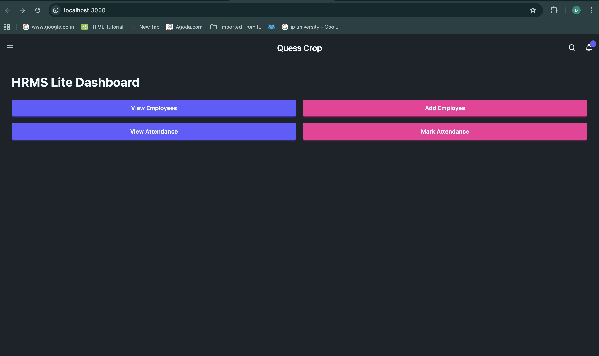
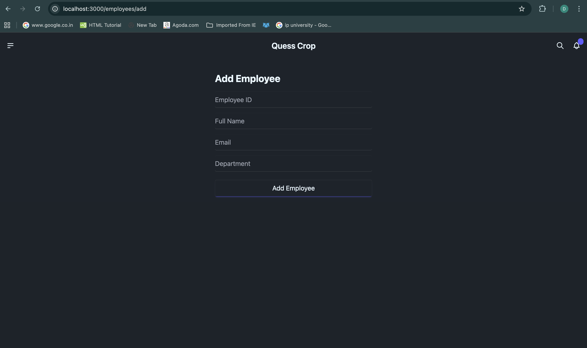
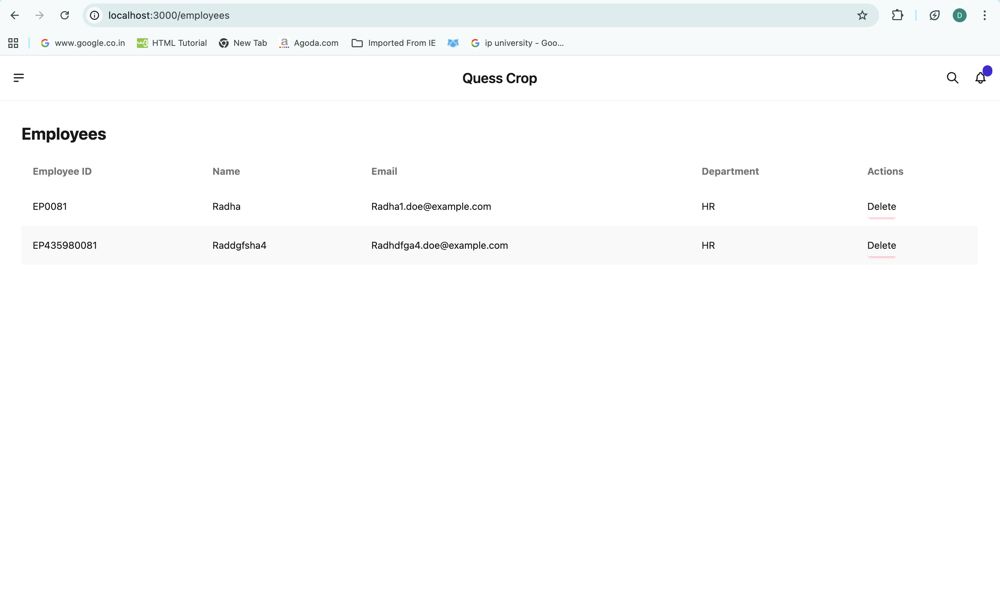

# [HRMS Lite – Employee & Attendance Management API](<[https://travel-saathi.netlify.app/](https://food-app-client-three.vercel.app)>)

## 📌 Introduction

[](https://awesome.re)

A simple HRMS Lite backend system built with Django REST Framework to manage employees and their attendance.
The system allows creating employees, marking attendance, and retrieving attendance records through REST APIs.

## 👨‍💻 Tech Stack Used

### Frontend

- ReactJS, TailwindCSS, JavaScript, Axios

### Backend

- Python.js, MongoDB

## 🛠️ Installation Steps

Star and Fork the Repo 🌟 and this will keep us motivated.

1. Clone the repository

```bash
git clone https://github.com/subhashdippu/Quess Crop.git
```

2. Change the working directory

```bash
cd Quess Crop
```

3. Install dependencies

```bash
npm install
```

4. Run the app

```bash
npm run start
```

## 📸 Screenshots




